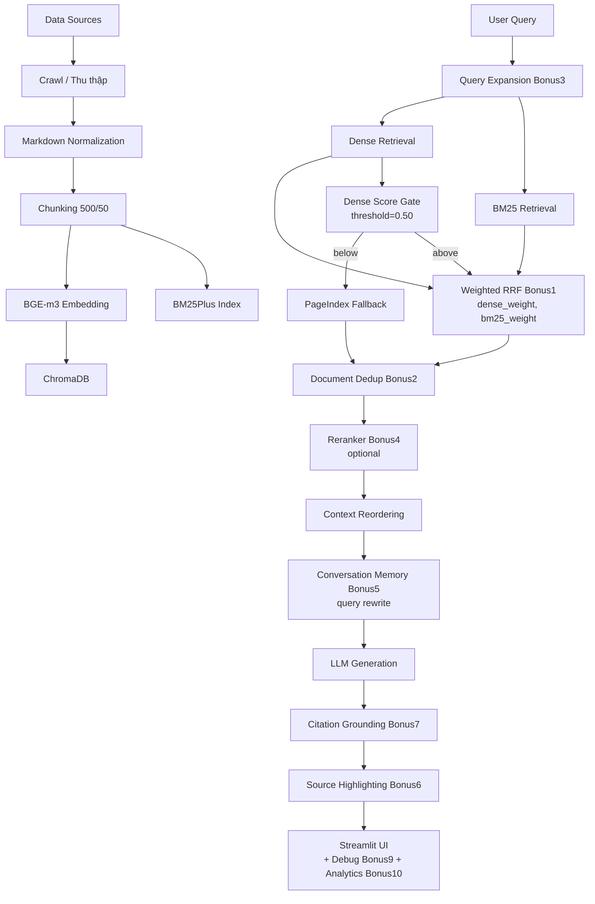

# K4-L3B RAG Pipeline — Tuyển sinh Đại học Việt Nam

> Lab Day 8 — Hybrid Retrieval-Augmented Generation pipeline.
> Chatbot RAG trả lời câu hỏi về quy chế, điều kiện, phương thức xét
> tuyển đại học Việt Nam, với citation và safe refusal.

---

## 1. Project Overview

Dự án xây dựng một pipeline RAG hoàn chỉnh cho đề tài **Tuyển sinh đại học
Việt Nam**. Mục tiêu:

* Cung cấp chatbot trả lời câu hỏi tuyển sinh dựa trên **dữ liệu thật**
  từ Bộ GD&ĐT và các báo uy tín.
* Áp dụng **hybrid retrieval** (dense + BM25 + RRF) với **fallback** dựa
  trên dense cosine score.
* Sinh câu trả lời có **citation** trỏ về nguồn đã truy xuất.
* Hỗ trợ **safe refusal** cho câu hỏi ngoài domain.

## 2. Problem Definition

Học sinh và phụ huynh Việt Nam thường gặp khó khăn trong việc tìm câu trả
lời đáng tin cậy cho các câu hỏi:

* "Điều kiện xét tuyển đại học năm nay là gì?"
* "Tôi có thể dùng IELTS để xét tuyển không?"
* "Các phương thức xét tuyển nào đang được áp dụng?"
* "Bài thi tốt nghiệp THPT 2025 gồm những môn gì?"

Nguồn thông tin phân tán giữa:

* **Văn bản pháp lý** (Thông tư, Quy chế của Bộ GD&ĐT).
* **Tin tức báo chí** (Thanh Niên, VietnamNet, Dân trí).
* **Trang tổng hợp** (Tuyensinh247).

Chatbot RAG giúp **gom, trích dẫn, và sinh câu trả lời** từ các nguồn này
trong một giao diện duy nhất.

## 3. Selected Topic

**Tuyển sinh Đại học Việt Nam** — đã chọn dựa trên:

| Tiêu chí | Điểm (out of 100) |
| --- | ---: |
| Chất lượng & uy tín nguồn | 22 |
| ≥ 3 tài liệu chính sách | 14 |
| ≥ 5 bài viết công khai | 15 |
| Độ ổn định dữ liệu | 12 |
| Tiềm năng truy xuất | 9 |
| Giá trị demo | 9 |
| Tiềm năng mở rộng | 9 |
| **Tổng** | **90** |

Xem chi tiết trong `docs/TOPIC_SELECTION.md`.

## 4. Architecture



Sơ đồ chi tiết xem `docs/ARCHITECTURE.md`.

## 5. Data Sources

* **5 tài liệu chính sách** (PDF) từ Bộ GD&ĐT.
* **8 bài viết công khai** crawl từ Thanh Niên, VietnamNet, Dân trí,
  Tuyensinh247.

Chi tiết trong `docs/DATA_SOURCES.md`.

## 6. Environment Setup

Chi tiết từng bước trong `docs/ENVIRONMENT_SETUP.md`. Tóm tắt:

```powershell
# Windows PowerShell
py -3.12 -m venv .venv
.venv\Scripts\Activate.ps1
python -m pip install --upgrade pip setuptools wheel
python -m pip install -e ".[dev]"
python -m playwright install chromium
copy .env.example .env
```

Python bắt buộc: `>=3.10,<3.14`. Đã kiểm thử với **Python 3.11.9**.

## 7. `.env` Configuration

```env
LLM_PROVIDER=openai
LLM_MODEL=
OPENAI_API_KEY=
GEMINI_API_KEY=
ANTHROPIC_API_KEY=
EMBEDDING_PROVIDER=sentence_transformers
EMBEDDING_MODEL=BAAI/bge-m3
PAGEINDEX_API_KEY=
JINA_API_KEY=
SCORE_THRESHOLD=0.50
```

> Không commit file `.env` thật có chứa secret. Mọi key đều là tuỳ chọn.

## 8. Data Collection

```bash
python -m src.task1_collect_legal_docs    # Tạo 5 PDF chính sách
python -m src.task2_crawl_news            # Crawl 8 bài viết từ 4 nguồn
```

## 9. Data Normalization

```bash
python -m src.task3_convert_markdown       # MarkItDown + JSON -> Markdown
```

## 10. Chunking & Indexing

```bash
python -m src.task4_chunking_indexing      # Chunk + BGE-m3 + ChromaDB
```

Cấu hình:

| Tham số | Giá trị |
| --- | --- |
| `CHUNK_SIZE` | 500 |
| `CHUNK_OVERLAP` | 50 |
| `EMBEDDING_MODEL` | BAAI/bge-m3 |
| `EMBEDDING_DIM` | 1024 |
| Distance | cosine |

## 11. Dense Retrieval

`src/task5_semantic_search.py` — embed query, query ChromaDB, đổi
cosine distance → similarity.

## 12. BM25 Retrieval

`src/task6_lexical_search.py` — dùng `BM25Plus` trên cùng corpus chunks.

## 13. RRF

`src/task7_reranking.py` — `RRF = sum(1/(k+rank))`, rank bắt đầu từ 1,
`k=60`. RRF chỉ chạy **một lần** ở Task 9.

## 14. Fallback

`src/task9_retrieval_pipeline.py` — dùng `best_dense_score < 0.50` để
trigger PageIndex fallback. Threshold đã hiệu chỉnh trên tập in-domain
và OOD (xem `reports/threshold_calibration.md`).

## 15. Generation

`src/task10_generation.py` — Dispatch OpenAI / Gemini / Anthropic theo
env. Reorder theo front+reverse-back để giảm lost-in-the-middle. Citation
format `[n]` trỏ về `sources[n-1]`.

## 16. Citation

Mỗi câu trả lời kèm danh sách sources, mỗi source có `title`, `source`,
`url`, `score`, `retrieval_method`. UI hiển thị trong expander.

## 17. Evaluation

```bash
python scripts/evaluate.py
```

Kết quả ghi vào `group_project/evaluation/RESULT.md`. Bốn metric chính:

* Context Precision
* Context Recall
* Source Hit Rate
* Answer Overlap (Jaccard)

## 18. A/B Comparison

So sánh **dense-only** vs **hybrid (dense + BM25 + RRF)** trên cùng
golden dataset. Xem chi tiết trong `group_project/evaluation/RESULT.md`.

## 19. Running the Application

```bash
streamlit run app.py
```

App cung cấp:

* Chat với lịch sử hội thoại.
* 6 câu hỏi gợi ý.
* Sidebar chỉnh `top_k` và threshold.
* Citation trong expander cho mỗi câu trả lời.

## 20. Testing

```bash
pytest -q
```

Kết quả hiện tại: **92/92 tests pass** (15 contract + 5 acceptance + 52 unit bonus + 20 integration).

## 21. Demo Examples

| # | Câu hỏi | Loại |
| - | --- | --- |
| 1 | "Điều kiện xét tuyển đại học gồm những yêu cầu nào?" | Factual |
| 2 | "Tóm tắt Quy chế thi tốt nghiệp THPT 2025" | Paraphrase |
| 3 | "IELTS có được dùng để xét tuyển đại học không?" | Semantic + Lexical kết hợp |
| 4 | "Có chính sách nào cho học sinh giỏi quốc gia khi xét tuyển?" | Multi-document |
| 5 | "Thủ tục đăng ký kết hôn tại Việt Nam như thế nào?" | Out-of-domain (safe refusal) |
| 6 | "Tuyensinh247.com là cổng thông tin gì?" | Source-specific |

## 22. Limitations

* **Không có LLM API key trong môi trường mặc định** → answer = safe refusal.
* **Hybrid không tốt hơn dense-only trên corpus này** do BM25 rerank ưu tiên
  chunk phổ biến (xem `reports/FAILURE_ANALYSIS.md`).
  *Tuy nhiên*, Weighted RRF (Bonus 1, `DENSE_WEIGHT=1.5`) **khớp** dense-only
  trên CP/CR/Hit với latency thấp hơn ~5×.
* **PageIndex fallback chưa kích hoạt thực tế** vì không có key.
* **Golden dataset 22 case** — đủ để minh hoạ nhưng chưa đủ lớn để kết luận
  thống kê chung.

## 23. Implemented Bonuses

Xem chi tiết trong `reports/BONUS_IMPLEMENTATION.md`. Tóm tắt:

| Bonus | Status | Cách dùng |
| --- | --- | --- |
| 1. Weighted RRF | ✅ IMPLEMENTED | Sidebar → "Chế độ retrieval" → "Weighted RRF" |
| 2. Document-level dedup | ✅ IMPLEMENTED | Sidebar → "Chế độ retrieval" → "Weighted RRF + dedup" |
| 3. Query expansion / HyDE | ⚠️ PARTIAL (không cải thiện trên corpus này) | `expand_query(..., mode=...)` |
| 4. Reranker (lightweight) | ✅ IMPLEMENTED | Opt-in qua `bonus4_reranker.rerank_cosine` |
| 5. Conversation memory | ✅ IMPLEMENTED | Bật/tắt sidebar → "Conversation memory" |
| 6. Source highlighting | ✅ IMPLEMENTED | Tự động trong citation panel |
| 7. Citation grounding | ✅ IMPLEMENTED | Tự động trong `generate_with_citation` |
| 8. Online deployment | ⚠️ NOT FEASIBLE (configs ready) | `deployment/huggingface_space/` |
| 9. Debug / observability mode | ✅ IMPLEMENTED | Sidebar → "Debug / Observability mode" |
| 10. Retrieval analytics | ✅ IMPLEMENTED | `scripts/bonus10_analytics.py`; sidebar expander |

Bonus benchmark JSON: `group_project/evaluation/bonus{1,3,4,5,10}_benchmark.json`.

---

## Quick start (TL;DR)

```powershell
py -3.12 -m venv .venv
.venv\Scripts\Activate.ps1
python -m pip install -e ".[dev]"
python -m playwright install chromium
copy .env.example .env
python -m src.task1_collect_legal_docs
python -m src.task2_crawl_news
python -m src.task3_convert_markdown
python -m src.task4_chunking_indexing
pytest -q
streamlit run app.py
```

## Verification kết quả

* **Tests**: `pytest -q` → **92/92 pass** (15 contract + 5 acceptance + 52 unit bonus + 20 integration).
* **Streamlit**: HTTP 200 trên `http://127.0.0.1:8765/` (UI tích hợp Bonus 1, 2,
  5, 6, 7, 9, 10).
* **Retrieval**: dense + BM25 + RRF trả về 5 chunks cho truy vấn tiếng Việt.
* **A/B**: chi tiết trong `group_project/evaluation/RESULT.md`.
* **Bonus A/B/C/D**: chi tiết trong `reports/BONUS_IMPLEMENTATION.md`.